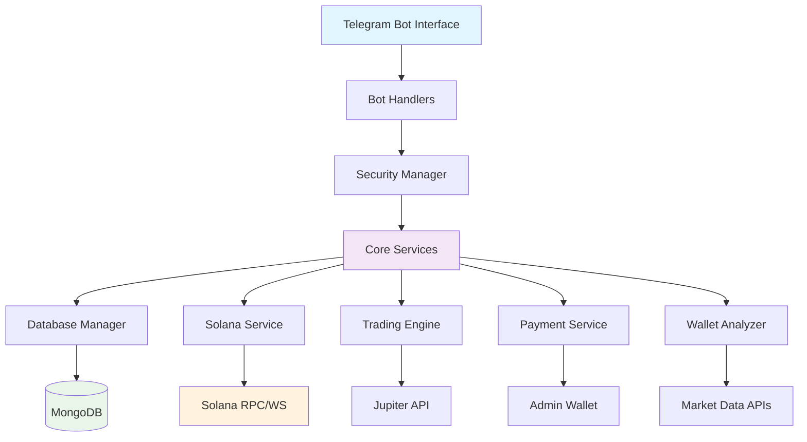

# 🚀 Solana Trading & Wallet Analysis Bot

[](https://python.org)
[](https://solana.com)
[](https://core.telegram.org/bots/api)
[](https://mongodb.com)
[](LICENSE)

> **Professional-grade multi-user Solana trading platform with advanced analytics, automated trading, and comprehensive wallet management - all accessible through an intuitive Telegram interface.**

## 📋 Table of Contents

- [🎯 Overview](#-overview)
- [✨ Key Features](#-key-features)
- [🏗️ Architecture](#️-architecture)
- [🚀 Quick Start](#-quick-start)
- [⚙️ Configuration](#️-configuration)
- [🔧 Installation](#-installation)
- [📱 Usage](#-usage)
- [🔒 Security](#-security)
- [💰 Revenue Model](#-revenue-model)
- [🧪 Testing](#-testing)
- [📊 Monitoring](#-monitoring)
- [🤝 Contributing](#-contributing)

## 🎯 Overview

The **Solana Trading Bot** is a comprehensive, production-ready trading platform that brings professional-grade Solana blockchain trading capabilities directly to Telegram. Built with a modular architecture, it supports multiple users, automated fee collection, advanced trading strategies, and real-time market analysis.

### 🌟 What Makes This Special

- **🔄 Multi-User Platform**: Supports unlimited concurrent users with individual wallet management
- **💎 Professional Interface**: Button-based UI optimized for mobile trading
- **⚡ Real-Time Trading**: Instant market orders with Jupiter DEX aggregation
- **🤖 Automated Features**: Copy trading, limit orders, stop-losses, and whale tracking
- **💰 Revenue Generation**: Built-in subscription system with automatic fee collection
- **🛡️ Enterprise Security**: Rate limiting, input validation, and encrypted storage

## ✨ Key Features

### 💼 **Wallet Management**
- **Multi-Wallet Support**: Create and manage multiple Solana wallets per user
- **Secure Import/Export**: Encrypted private key storage with AES-256
- **Real-Time Balances**: Live SOL and SPL token balance tracking
- **Portfolio Analytics**: Comprehensive portfolio performance metrics

### ⚡ **Advanced Trading**
- **Market Orders**: Instant buy/sell with best price routing via Jupiter
- **Limit Orders**: Set target prices for automatic execution
- **Stop-Loss Orders**: Risk management with automatic sell triggers
- **Copy Trading**: Follow and replicate successful trader strategies
- **DEX Integration**: Direct access to Raydium, Serum, and other major DEXs

### 📊 **Analytics & Monitoring**
- **Wallet Analysis**: Deep-dive analytics for any Solana wallet
- **Token Research**: Comprehensive token metrics, holders, and trends
- **Whale Tracking**: Monitor large transactions and market movements
- **Market Insights**: Real-time market data and sentiment analysis

### 🔔 **Smart Alerts**
- **Price Alerts**: Custom price targets with instant notifications
- **Whale Alerts**: Large transaction monitoring with customizable thresholds
- **Portfolio Alerts**: Balance changes and performance notifications
- **Trading Alerts**: Order execution and market opportunity alerts

### 💰 **Subscription System**
- **Tiered Plans**: Free, Premium (0.1 SOL/month), Pro (0.5 SOL/month)
- **Automatic Billing**: Seamless subscription renewals with SOL payments
- **Feature Gating**: Access control based on subscription level
- **Revenue Tracking**: Complete admin dashboard for payment monitoring

## 🏗️ Architecture



### 🔧 **Core Services**

| Service | Purpose | Key Features |
|---------|---------|--------------|
| **DatabaseManager** | Data persistence | User profiles, wallets, trades, payments |
| **SolanaService** | Blockchain interaction | RPC calls, transaction execution, balance queries |
| **TradingEngine** | Order management | Market/limit orders, copy trading, automation |
| **PaymentService** | Revenue collection | Subscription billing, fee processing |
| **WalletAnalyzer** | Analytics engine | Portfolio tracking, performance metrics |
| **SecurityManager** | Protection layer | Rate limiting, input validation, authentication |

## 🚀 Quick Start

### Prerequisites
- Python 3.8+
- MongoDB 4.4+
- Telegram Bot Token
- Solana Wallet with SOL for fees

### 1. Clone & Setup
```bash
git clone <repository-url>
cd solana-trading-bot
python -m venv venv
source venv/bin/activate  # On Windows: venv\Scripts\activate
pip install -r requirements.txt
```

### 2. Configure Environment
```bash
# For testnet (recommended first)
cp env.testnet.example .env
# For production
cp env.production .env
```

### 3. Configure Your Settings
Edit `.env` with your credentials:
```env
TELEGRAM_BOT_TOKEN=your_bot_token_here
SOLANA_RPC_URL=https://api.mainnet-beta.solana.com
PRIVATE_KEY=your_base58_private_key_here
ADMIN_CHAT_ID=your_telegram_chat_id
DATABASE_URL=mongodb://localhost:27017/solana_bot
```

### 4. Launch
```bash
# Testnet (safe testing)
python main_testnet.py

# Production (real trading)
python main.py
```

## ⚙️ Configuration

### 🔧 **Environment Variables**

| Variable | Description | Default | Required |
|----------|-------------|---------|----------|
| `TELEGRAM_BOT_TOKEN` | Telegram bot token from @BotFather | - | ✅ |
| `SOLANA_RPC_URL` | Solana RPC endpoint | mainnet-beta | ✅ |
| `PRIVATE_KEY` | Base58 encoded Solana private key | - | ✅ |
| `DATABASE_URL` | MongoDB connection string | localhost:27017 | ✅ |
| `ADMIN_CHAT_ID` | Telegram admin chat ID | - | ✅ |
| `MAX_TRADE_AMOUNT` | Maximum trade size (SOL) | 10.0 | ❌ |
| `DEFAULT_SLIPPAGE` | Default slippage tolerance (%) | 0.5 | ❌ |
| `WHALE_THRESHOLD_SOL` | Whale detection threshold | 1000 | ❌ |

### 💎 **Subscription Tiers**

| Tier | Monthly Fee | Max Wallets | Max Alerts | Features |
|------|-------------|-------------|------------|----------|
| **Free** | 0 SOL | 1 | 5 | Basic trading, wallet monitoring |
| **Premium** | 0.1 SOL | 3 | 20 | Copy trading, whale alerts, priority support |
| **Pro** | 0.5 SOL | 10 | 100 | API access, custom strategies, VIP support |

### 🎛️ **Trading Configuration**

```python
# Trading Limits
MAX_TRADE_AMOUNT = 10.0  # SOL
MIN_TRADE_AMOUNT = 0.01  # SOL
DEFAULT_SLIPPAGE = 0.5   # %

# Fee Structure
TRANSACTION_FEE_PERCENTAGE = 0.1  # 0.1% per trade
WALLET_CREATION_FEE = 0.01        # SOL
SUBSCRIPTION_FEE_PERCENTAGE = 0.1 # Additional fee on subscriptions
```

## 🔧 Installation

### 📦 **System Requirements**

- **OS**: Linux, macOS, Windows
- **Python**: 3.8 or higher
- **Memory**: 2GB RAM minimum, 4GB recommended
- **Storage**: 10GB free space for logs and data
- **Network**: Stable internet connection (trading requires low latency)

### 🐍 **Python Dependencies**

```bash
pip install -r requirements.txt
```

**Key Dependencies:**
- `python-telegram-bot==20.7` - Telegram Bot API
- `solana==0.32.0` - Solana blockchain interaction
- `pymongo==4.6.1` - MongoDB database driver
- `aiohttp==3.9.1` - Async HTTP client
- `cryptography==41.0.8` - Encryption and security

### 🗄️ **Database Setup**

```bash
# Install MongoDB
# Ubuntu/Debian
sudo apt-get install mongodb

# macOS
brew install mongodb-community

# Start MongoDB service
sudo systemctl start mongod  # Linux
brew services start mongodb-community  # macOS
```

## 📱 Usage

### 🎮 **Bot Commands**

| Command | Description | Access Level |
|---------|-------------|--------------|
| `/start` | 🚀 Initialize bot and show main menu | All users |
| `/wallet` | 💼 Wallet operations and management | All users |
| `/trade` | ⚡ Trading interface and order management | All users |
| `/analyze` | 📊 Analysis tools and market insights | All users |
| `/settings` | ⚙️ User preferences and configuration | All users |
| `/admin` | 🔧 Administrative panel and controls | Admin only |

### 🎯 **Button Interface**

The bot features a complete button-based interface:

```
🚀 Main Menu
├── 💼 Wallet Operations
│   ├── ➕ Create New Wallet
│   ├── 📥 Import Existing Wallet
│   ├── 👁️ View All Wallets
│   └── 📊 Portfolio Overview
├── ⚡ Trading Operations
│   ├── 🛒 Quick Buy
│   ├── 💰 Quick Sell
│   ├── 📈 Limit Orders
│   └── 🤖 Copy Trading
└── 📊 Analysis Tools
    ├── 🔍 Analyze Wallet
    ├── 🪙 Analyze Token
    └── 🐋 Whale Tracker
```

### 💡 **Usage Examples**

**Creating a Wallet:**
1. Send `/start` to the bot
2. Click "💼 Wallet Operations"
3. Click "➕ Create New Wallet"
4. Pay the 0.01 SOL creation fee
5. Receive your new wallet address and encrypted backup

**Executing a Trade:**
1. Navigate to "⚡ Trading Operations"
2. Click "🛒 Quick Buy" or "💰 Quick Sell"
3. Enter token address and amount
4. Confirm transaction details
5. Trade executes automatically with 0.1% fee

## 🔒 Security

### 🛡️ **Security Features**

- **🔐 Encrypted Storage**: All private keys encrypted with AES-256
- **⚡ Rate Limiting**: 60 requests per minute per user
- **🔍 Input Validation**: Comprehensive sanitization of all user inputs
- **🚨 Admin Controls**: Multi-level access control system
- **📝 Audit Logging**: Complete transaction and action logging
- **🔒 Process Isolation**: Single-instance lock mechanism

### 🔑 **Private Key Management**

```python
# Keys are encrypted before storage
encrypted_key = encrypt_private_key(private_key, user_password)
await db.store_encrypted_wallet(user_id, encrypted_key)

# Decryption only happens during transaction signing
decrypted_key = decrypt_private_key(encrypted_key, user_password)
```

### 🚨 **Security Best Practices**

1. **Use Dedicated Wallets**: Never use your main wallet for bot operations
2. **Start Small**: Begin with minimal amounts for testing
3. **Monitor Regularly**: Check all transactions and balances
4. **Secure Environment**: Use strong passwords and secure servers
5. **Regular Backups**: Backup your configuration and database

## 💰 Revenue Model

### 📈 **Revenue Streams**

1. **Trading Fees**: 0.1% on all buy/sell transactions
2. **Subscription Plans**: Monthly recurring revenue
3. **Wallet Creation**: 0.01 SOL one-time fee
4. **Premium Features**: Advanced analytics and tools

### 💎 **Subscription Benefits**

**Premium Plan (0.1 SOL/month):**
- Up to 3 wallets
- Copy trading access
- Whale alerts
- Priority support

**Pro Plan (0.5 SOL/month):**
- Up to 10 wallets
- API access
- Custom trading strategies
- VIP support
- Advanced analytics

### 📊 **Revenue Tracking**

```python
# Admin dashboard provides:
- Daily/monthly revenue reports
- User subscription analytics
- Trading volume statistics
- Fee collection summaries
```

## 🧪 Testing

### 🔬 **Testnet Environment**

```bash
# Run in safe testnet mode
python main_testnet.py
```

**Testnet Features:**
- ✅ All features available with testnet SOL
- ✅ Lower fees for testing (0.05% trading fees)
- ✅ Reduced limits for safe testing
- ✅ Separate database for isolation
- ✅ Debug logging enabled

### 🧪 **Testing Checklist**

```bash
# 1. Test network connectivity
python test_network.py

# 2. Verify wallet creation
# Use /wallet command in testnet bot

# 3. Test trading functionality
# Execute small test trades

# 4. Verify payment processing
# Test subscription upgrades

# 5. Check admin functions
# Use /admin command
```

## 📊 Monitoring

### 📈 **Performance Metrics**

- **Response Time**: Average bot response time
- **Trading Volume**: Daily/monthly trading statistics
- **User Activity**: Active users and engagement metrics
- **Error Rates**: System health and error tracking
- **Revenue Metrics**: Fee collection and subscription analytics

### 🔍 **Logging System**

```python
# Comprehensive logging with multiple levels
LOG_LEVEL=INFO  # DEBUG, INFO, WARNING, ERROR, CRITICAL
LOG_FILE=solana_bot.log

# Automatic log rotation and backup
BACKUP_ENABLED=true
```

### 📱 **Health Monitoring**

```bash
# Check bot status
./status.sh

# View real-time logs
tail -f solana_bot.log

# Restart bot if needed
./restart_bot.sh
```

## 🚀 Deployment

### 🌐 **Production Deployment**

1. **Server Setup**:
   ```bash
   # Ubuntu/Debian server recommended
   sudo apt update && sudo apt upgrade -y
   sudo apt install python3.8 python3-pip mongodb
   ```

2. **Environment Configuration**:
   ```bash
   cp env.production .env
   # Edit .env with production credentials
   ```

3. **Service Setup**:
   ```bash
   # Create systemd service
   sudo cp solana-bot.service /etc/systemd/system/
   sudo systemctl enable solana-bot
   sudo systemctl start solana-bot
   ```

4. **SSL & Security**:
   ```bash
   # Configure firewall
   sudo ufw allow 22  # SSH only
   sudo ufw enable
   
   # Set up SSL certificates for webhook mode (optional)
   sudo certbot --nginx -d yourdomain.com
   ```

### 🐳 **Docker Deployment**

```dockerfile
FROM python:3.9-slim

WORKDIR /app
COPY requirements.txt .
RUN pip install -r requirements.txt

COPY . .
CMD ["python", "main.py"]
```

```bash
# Build and run
docker build -t solana-trading-bot .
docker run -d --env-file .env solana-trading-bot
```

## 🔧 Advanced Configuration

### 🎛️ **Performance Tuning**

```env
# Network Optimization
TELEGRAM_TIMEOUT=30.0
TELEGRAM_CONNECT_TIMEOUT=10.0
TELEGRAM_READ_TIMEOUT=30.0

# Concurrency Settings
ASYNC_WORKERS=10
MAX_CONCURRENT_MONITORS=100
MONITOR_INTERVAL=5

# Caching
CACHE_TTL=300  # 5 minutes
```

### 🔐 **Security Hardening**

```env
# Rate Limiting
MAX_REQUESTS_PER_MINUTE=60
RATE_LIMIT_WINDOW=60

# Validation
STRICT_INPUT_VALIDATION=true
ENABLE_SIGNATURE_VERIFICATION=true

# Monitoring
SYSTEM_ALERTS_ENABLED=true
SUSPICIOUS_ACTIVITY_DETECTION=true
```

## 📚 API Reference

### 🔌 **Core APIs**

The bot integrates with multiple external APIs:

- **Solana RPC**: Blockchain data and transaction execution
- **Jupiter API**: DEX aggregation and price routing
- **CoinGecko API**: Token prices and market data
- **Telegram Bot API**: User interface and notifications

### 📊 **Internal APIs**

```python
# Trading Engine API
await trading_engine.create_market_order(user_id, token_address, amount)
await trading_engine.create_limit_order(user_id, token_address, amount, target_price)

# Wallet Analyzer API
await wallet_analyzer.analyze_wallet(wallet_address)
await wallet_analyzer.get_portfolio_performance(user_id)

# Payment Service API
await payment_service.process_subscription_payment(user_id, tier)
await payment_service.collect_trading_fee(user_id, trade_amount)
```

## 🤝 Contributing

### 🛠️ **Development Setup**

```bash
# Clone repository
git clone <repository-url>
cd solana-trading-bot

# Create development environment
python -m venv dev-env
source dev-env/bin/activate

# Install development dependencies
pip install -r requirements.txt
pip install -r requirements-dev.txt  # If available

# Run tests
python -m pytest tests/
```

### 📝 **Code Standards**

- **PEP 8**: Follow Python style guidelines
- **Type Hints**: Use type annotations for all functions
- **Async/Await**: Maintain async architecture throughout
- **Error Handling**: Comprehensive exception handling
- **Documentation**: Docstrings for all public methods

## 📄 License

This project is licensed under the MIT License - see the [LICENSE](LICENSE) file for details.

## 🆘 Support

### 📞 **Getting Help**

- **Documentation**: Check the `/docs` folder for detailed guides
- **Issues**: Report bugs via GitHub Issues
- **Community**: Join our Telegram support group
- **Email**: Contact support@yourbot.com

### 🔧 **Troubleshooting**

Common issues and solutions:

1. **Connection Issues**: Check RPC URL and network connectivity
2. **Transaction Failures**: Verify wallet balance and slippage settings
3. **Bot Unresponsive**: Check logs and restart if necessary
4. **Payment Issues**: Verify admin wallet configuration

## 🔬 Advanced Features

### 🤖 **Automated Trading Strategies**

```python
# Copy Trading Implementation
class CopyTradingStrategy:
    async def follow_wallet(self, target_wallet: str, allocation_percentage: float):
        """Automatically copy trades from successful wallets"""

# Limit Order Engine
class LimitOrderEngine:
    async def create_limit_order(self, token: str, target_price: float, amount: float):
        """Execute trades when price targets are reached"""

# Stop-Loss Protection
class RiskManagement:
    async def set_stop_loss(self, position: str, stop_price: float):
        """Automatic position closure for risk management"""
```

### 📊 **Advanced Analytics**

- **Portfolio Performance**: ROI tracking, P&L analysis, Sharpe ratio calculation
- **Market Sentiment**: Social sentiment analysis and trend prediction
- **Risk Metrics**: VaR calculation, correlation analysis, volatility tracking
- **Backtesting**: Historical strategy performance simulation

### 🔔 **Smart Alert System**

```python
# Configurable Alert Types
ALERT_TYPES = {
    "price_target": "Price reaches specified level",
    "whale_movement": "Large transactions detected",
    "portfolio_change": "Significant portfolio value change",
    "market_opportunity": "Arbitrage or trading opportunities",
    "risk_warning": "High volatility or risk detected"
}
```

## 🏭 Production Considerations

### 🚀 **Scalability**

- **Horizontal Scaling**: Multi-instance deployment with load balancing
- **Database Sharding**: MongoDB sharding for large user bases
- **Caching Layer**: Redis integration for high-frequency data
- **CDN Integration**: Static asset delivery optimization

### 🔄 **High Availability**

```yaml
# Docker Compose for HA deployment
version: '3.8'
services:
  bot:
    image: solana-trading-bot:latest
    replicas: 3
    restart: always
  mongodb:
    image: mongo:4.4
    volumes:
      - mongodb_data:/data/db
  redis:
    image: redis:alpine
    restart: always
```

### 📈 **Performance Optimization**

- **Connection Pooling**: Optimized database and RPC connections
- **Async Processing**: Non-blocking operations for all I/O
- **Memory Management**: Efficient data structures and garbage collection
- **Network Optimization**: Request batching and connection reuse

## 🔐 Enterprise Security

### 🛡️ **Security Architecture**

```python
# Multi-layer Security Implementation
class SecurityStack:
    - Rate Limiting: Per-user request throttling
    - Input Validation: SQL injection and XSS prevention
    - Authentication: Multi-factor admin authentication
    - Encryption: End-to-end data encryption
    - Audit Logging: Complete action audit trail
    - Network Security: VPN and firewall protection
```

### 🔒 **Compliance Features**

- **GDPR Compliance**: User data protection and deletion rights
- **AML/KYC Ready**: Transaction monitoring and reporting capabilities
- **Audit Trail**: Immutable transaction and action logging
- **Data Retention**: Configurable data retention policies

## 🌍 Multi-Network Support

### 🔗 **Supported Networks**

| Network | RPC Endpoint | Use Case |
|---------|--------------|----------|
| **Mainnet** | `api.mainnet-beta.solana.com` | Production trading |
| **Testnet** | `api.testnet.solana.com` | Safe testing |
| **Devnet** | `api.devnet.solana.com` | Development |

### 🌐 **Cross-Chain Integration Ready**

The architecture supports future expansion to other blockchains:
- Ethereum integration framework
- Polygon network support
- BSC compatibility layer

## 📊 Analytics Dashboard

### 📈 **Admin Analytics**

```python
# Revenue Analytics
- Daily/Monthly revenue tracking
- User acquisition metrics
- Trading volume analysis
- Subscription conversion rates
- Geographic user distribution

# Performance Metrics
- System uptime and reliability
- Transaction success rates
- Average response times
- Error rate monitoring
- Resource utilization
```

### 👥 **User Analytics**

- **Trading Behavior**: Pattern analysis and strategy effectiveness
- **Portfolio Performance**: Risk-adjusted returns and benchmarking
- **Usage Patterns**: Feature adoption and engagement metrics

## 🔧 Maintenance & Operations

### 🛠️ **Operational Scripts**

```bash
# Bot Management
./start_bot.sh          # Start bot with proper configuration
./restart_bot.sh        # Graceful restart with state preservation
./stop_bot.sh           # Clean shutdown with resource cleanup
./status.sh             # Health check and status report

# Database Operations
./backup_database.sh    # Create database backup
./restore_database.sh   # Restore from backup
./cleanup_logs.sh       # Log rotation and cleanup

# Monitoring
./health_check.sh       # Comprehensive system health check
./performance_report.sh # Generate performance analytics
```

### 📋 **Maintenance Checklist**

**Daily:**
- [ ] Check bot status and uptime
- [ ] Monitor error logs for issues
- [ ] Verify trading functionality
- [ ] Check revenue collection

**Weekly:**
- [ ] Database backup and verification
- [ ] Performance metrics review
- [ ] Security audit and updates
- [ ] User feedback analysis

**Monthly:**
- [ ] Dependency updates and security patches
- [ ] Capacity planning and scaling review
- [ ] Financial reporting and analysis
- [ ] Feature roadmap planning

## 🎯 Roadmap

### 🔮 **Upcoming Features**

**Q1 2024:**
- [ ] Advanced charting and technical analysis
- [ ] Mobile app companion
- [ ] API marketplace for third-party integrations
- [ ] Multi-language support

**Q2 2024:**
- [ ] Cross-chain trading support
- [ ] AI-powered trading signals
- [ ] Social trading features
- [ ] Institutional client support

**Q3 2024:**
- [ ] DeFi yield farming integration
- [ ] NFT trading capabilities
- [ ] Advanced risk management tools
- [ ] White-label solutions

## 🏆 Success Metrics

### 📊 **KPIs to Track**

- **User Growth**: Monthly active users, retention rates
- **Trading Volume**: Daily/monthly volume, average trade size
- **Revenue**: MRR, ARPU, subscription conversion rates
- **Performance**: Uptime, response times, error rates
- **User Satisfaction**: Support tickets, user ratings, feature requests

---

<div align="center">

**🚀 Ready to revolutionize Solana trading? Deploy your bot today!**

[](PRODUCTION_LAUNCH_CHECKLIST.md)
[](TESTNET_SETUP_GUIDE.md)
[](docs/)

[📚 Documentation](docs/) | [🐛 Report Issues](issues/) | [💬 Community](https://t.me/your_support_group) | [🔧 Admin Guide](ADMIN_GUIDE.md)

**⭐ Star this repository if you found it helpful!**

</div>
